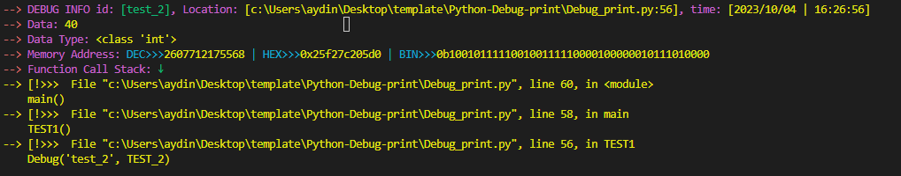

# Python Debug print

This function is used for debugging purposes. It prints out various information about the data passed to it.

>  **Note**\
>  Please note that this code uses my print_color\
>  for more info go to https://github.com/Aydinhamedi/Python-color-print.

## Installation

No installation is required for this function. Simply copy the code and use it in your project.

## Usage

```python
#pylibs
import inspect
import traceback
from datetime import datetime
#global Var
Debug_m = True
#the print_Color func
# more info on https://github.com/Aydinhamedi/Python-color-print
def print_Color(Input: str, colors: list, print_END: str = '\n', advanced_mode: bool = False):
    """
    Prints colored text to the console using advanced terminal colors.

    Args:
        Input (str): The input string to be printed. In advanced mode, '~*' is used to separate different parts of the string to be printed in different colors.
        colors (list): A list of colors for the text. In non-advanced mode, only the first color in the list is used. In advanced mode, each color corresponds to a part of the input string separated by '~*'.
        print_END (str): The string appended after the final output. Default is '\\n'.
        advanced_mode (bool): If True, enables advanced mode that allows multiple colors in one string. Default is False.

    Examples:
    ~~~python
        print_Color('Hello, World!', ['green']) 
        # Prints 'Hello, World!' in green.

        print_Color('~*Hello in green~*Hello in red', ['green', 'red'], advanced_mode=True) 
        # Prints 'Hello in green' in green and 'Hello in red' in red.

    Note:
        The advanced terminal colors can be used by providing the escape sequences directly in the colors list.
        If an invalid color is provided, an error message will be printed.
    """
    color_code = {
        'black': '\x1b[0;30m',
        'red': '\x1b[0;31m',
        'green': '\x1b[0;32m',
        'yellow': '\x1b[0;33m',
        'blue': '\x1b[0;34m',
        'magenta': '\x1b[0;35m',
        'cyan': '\x1b[0;36m',
        'white': '\x1b[0;37m',
        'normal': '\x1b[0m',
        'bg_black': '\x1b[40m',
        'bg_red': '\x1b[41m',
        'bg_green': '\x1b[42m',
        'bg_yellow': '\x1b[43m',
        'bg_blue': '\x1b[44m',
        'bg_magenta': '\x1b[45m',
        'bg_cyan': '\x1b[46m',
        'bg_white': '\x1b[47m',
        'bg_normal': '\x1b[49m',
        'light_gray': '\x1b[0;90m',
        'light_red': '\x1b[0;91m',
        'light_green': '\x1b[0;92m',
        'light_yellow': '\x1b[0;93m',
        'light_blue': '\x1b[0;94m',
        'light_magenta': '\x1b[0;95m',
        'light_cyan': '\x1b[0;96m',
        'light_white': '\x1b[0;97m',
        'bg_light_gray': '\x1b[0;100m',
        'bg_light_red': '\x1b[0;101m',
        'bg_light_green': '\x1b[0;102m',
        'bg_light_yellow': '\x1b[0;103m',
        'bg_light_blue': '\x1b[0;104m',
        'bg_light_magenta': '\x1b[0;105m',
        'bg_light_cyan': '\x1b[0;106m',
        'bg_light_white': '\x1b[0;107m',
        'bold': '\x1b[1m',
        'underline': '\x1b[4m',
        'blink': '\x1b[5m'
    }

    if not advanced_mode:
        if colors[0] in color_code:
            print(color_code[colors[0]] + Input + '\x1b[0m', end=print_END)
        else:
            print("[print_Color] ERROR: Invalid color input!!!")
    else:
        substrings = Input.split('~*')
        if len(substrings) != len(colors) + 1:
            print("[print_Color] ERROR: Number of colors and number of '~*' don't match!!!")
        else:
            for sub_str, color in zip(substrings, ['normal'] + colors):
                if color in color_code:
                    print(color_code[color] + sub_str + '\x1b[0m', end='')
                else:
                    print(f"\n[print_Color] ERROR: Invalid color!!! The input color: '{color}' input list index: {colors.index(color)}")
            print('', end=print_END)
#the func end
#Debug
def Debug(ID, DEBUG_IF, SFL: bool = True, Force: bool = False, SFCS: bool = True):
    """
    This function is used for debugging purposes. It prints out various information about the data passed to it.

    Args:
        ID (Any): The identifier for the data. This could be any type, but is typically a string.
        DEBUG_IF (Any): The data that needs to be debugged. This could be any type.
        SFL (bool, optional): A flag to determine if the stack frame location should be included in the debug information. Defaults to True.
        Force (bool, optional): A flag to force the debug information to be printed even if the global Debug_m is set to False. Defaults to False.
        SFCS (bool, optional): A flag to determine if the function call stack should be included in the debug information. Defaults to True.

    Returns:
        None
    """
    try:
        if Debug_m or Force:
            frame_info = inspect.currentframe()
            stack_trace = traceback.format_stack()
            stack_trace_formated = ''
            for line in stack_trace[:-1]:
                stack_trace_formated += '--> [!>>>' + line 
            location = f'{inspect.stack()[1].filename}:{frame_info.f_back.f_lineno}' if SFL else f'L:{frame_info.f_back.f_lineno}'
            Debug_data = \
            f'\n~*--> ~*DEBUG INFO id: ~*[{str(ID)}]~*, ' \
            f'Location: ~*[{location}]~*, ' \
            f'time: ~*[{datetime.now().strftime("%Y/%m/%d | %H:%M:%S")}]\n~*--> ~*' \
            f'Data: ~*{str(DEBUG_IF)}\n~*--> ~*' \
            f'Data Type: ~*{type(DEBUG_IF)}\n~*--> ~*' \
            f'Memory Address: ~*DEC>>>~*{id(DEBUG_IF)}~* | HEX>>>~*{hex(id(DEBUG_IF))}~* | BIN>>>~*{bin(id(DEBUG_IF))}\n' 
            if SFCS:
                Debug_data += f'~*--> ~*Function Call Stack: ~*↓\n~*{stack_trace_formated}\n'
            print_Color(Debug_data,
            ['red', 'magenta', 'green', 'magenta', 'yellow', 'magenta', 'yellow',
            'red', 'magenta', 'yellow', 'red', 'magenta', 'yellow', 'red', 'magenta',
            'cyan', 'yellow', 'cyan', 'yellow', 'cyan', 'yellow', 'red', 'magenta', 'green', 'yellow'] if SFCS else \
            ['red', 'magenta', 'green', 'magenta', 'yellow', 'magenta', 'yellow',
            'red', 'magenta', 'yellow', 'red', 'magenta', 'yellow', 'red', 'magenta',
            'cyan', 'yellow', 'cyan', 'yellow', 'cyan', 'yellow'], 
            advanced_mode=True)
    except NameError:
        print_Color('~*[`Debug` func] --> ERROR: ~*carate a global var named `Debug_m` for turning on and off the Debug func.', ['red', 'yellow'], advanced_mode=True)
# Example usage
Debug("data_id", data_to_debug)
```

## Arguments

- `ID`: The identifier for the data. This could be any type, but is typically a string.
- `DEBUG_IF`: The data that needs to be debugged. This could be any type.
- `SFL` (optional): A flag to determine if the stack frame location should be included in the debug information. Defaults to True.
- `Force` (optional): A flag to force the debug information to be printed even if the global `Debug_m` is set to False. Defaults to False.
- `SFCS` (optional): A flag to determine if the function call stack should be included in the debug information. Defaults to True.

## Output

The `Debug` function will print out the following information:

- Debug information ID, location, and timestamp
- Data value and data type
- Memory address in decimal, hexadecimal, and binary format
- Function call stack (if `SFCS` flag is set to True)

### Example usage img ↓
 
## Contributing

Contributions to this project are welcome. If you find any issues or have suggestions for improvements, please submit a pull request or open an issue.

## License

This project is licensed under the [MIT License](LICENSE).
